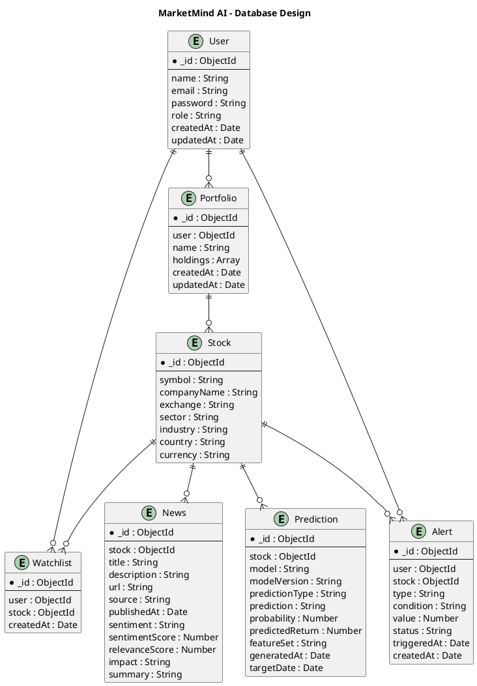

# MarketMind AI — Database Design

## 1. Overview

MarketMind AI uses MongoDB as its primary database because of its flexible document-oriented structure and its suitability for storing user information, stock metadata, financial news, machine learning predictions, watchlists, portfolios, and alerts.

The database is designed to separate frequently changing market information from application-specific data. External market data APIs will initially act as the primary source for current and historical market prices, while MongoDB will store information required by the application.

The initial database consists of seven primary collections:

* Users
* Stocks
* News
* Predictions
* Watchlists
* Portfolios
* Alerts

---

## 2. Database Architecture

The high-level relationship between the major entities is:

```text
User
│
├── Watchlists ─────────── Stock
│
├── Portfolios
│       │
│       └── Holdings ───── Stock
│
└── Alerts ─────────────── Stock

Stock
│
├── News
│
└── Predictions
```

A stock can therefore have multiple related news articles and machine learning predictions, while users can maintain multiple watchlist entries, portfolios, and alerts.

---

## 3. Users Collection

### Collection Name

`users`

### Purpose

Stores registered user accounts and authentication-related information.

### Fields

| Field       | Type     | Description            |
| ----------- | -------- | ---------------------- |
| `_id`       | ObjectId | Unique user identifier |
| `name`      | String   | User's name            |
| `email`     | String   | Unique email address   |
| `password`  | String   | Hashed password        |
| `role`      | String   | User role              |
| `createdAt` | Date     | Account creation date  |
| `updatedAt` | Date     | Last update date       |

### Example

```json
{
  "_id": "ObjectId",
  "name": "Aadarsh Jha",
  "email": "user@example.com",
  "password": "hashed_password",
  "role": "user",
  "createdAt": "2026-08-13",
  "updatedAt": "2026-08-13"
}
```

Passwords will never be stored as plain text. They will be securely hashed before being stored in the database.

---

## 4. Stocks Collection

### Collection Name

`stocks`

### Purpose

Stores relatively stable information about companies and financial instruments supported by the application.

### Fields

| Field         | Type     | Description             |
| ------------- | -------- | ----------------------- |
| `_id`         | ObjectId | Unique stock identifier |
| `symbol`      | String   | Stock ticker symbol     |
| `companyName` | String   | Company name            |
| `exchange`    | String   | Stock exchange          |
| `sector`      | String   | Business sector         |
| `industry`    | String   | Industry classification |
| `country`     | String   | Country                 |
| `currency`    | String   | Trading currency        |
| `logo`        | String   | Company logo URL        |
| `description` | String   | Company description     |
| `createdAt`   | Date     | Record creation date    |
| `updatedAt`   | Date     | Last update date        |

### Example

```json
{
  "_id": "ObjectId",
  "symbol": "TCS",
  "companyName": "Tata Consultancy Services",
  "exchange": "NSE",
  "sector": "Technology",
  "industry": "Information Technology",
  "country": "India",
  "currency": "INR"
}
```

Current stock prices will not be permanently stored in this collection because prices change frequently. Current market information will be obtained through the market-data service.

---

## 5. News Collection

### Collection Name

`news`

### Purpose

Stores relevant financial news articles associated with stocks and their processed AI/NLP information.

### Fields

| Field            | Type     | Description                    |
| ---------------- | -------- | ------------------------------ |
| `_id`            | ObjectId | Unique news identifier         |
| `stock`          | ObjectId | Reference to the related stock |
| `title`          | String   | Article title                  |
| `description`    | String   | Article description            |
| `url`            | String   | Original article URL           |
| `source`         | String   | News source                    |
| `author`         | String   | Article author                 |
| `publishedAt`    | Date     | Publication time               |
| `sentiment`      | String   | Positive, neutral, or negative |
| `sentimentScore` | Number   | Numerical sentiment score      |
| `relevanceScore` | Number   | Relevance to the stock         |
| `impact`         | String   | Estimated impact level         |
| `summary`        | String   | AI-generated summary           |
| `createdAt`      | Date     | Database record creation time  |
| `updatedAt`      | Date     | Last update time               |

### Example

```json
{
  "_id": "ObjectId",
  "stock": "ObjectId",
  "title": "Company announces major technology contract",
  "description": "Company announces a major new contract.",
  "url": "https://example.com/article",
  "source": "Financial News",
  "author": "Reporter",
  "publishedAt": "2026-08-13T08:30:00Z",
  "sentiment": "positive",
  "sentimentScore": 0.82,
  "relevanceScore": 0.94,
  "impact": "high",
  "summary": "The company announced a major contract."
}
```

### Sentiment Values

```text
positive
neutral
negative
```

### Impact Values

```text
low
medium
high
```

---

## 6. Predictions Collection

### Collection Name

`predictions`

### Purpose

Stores the outputs generated by the machine learning service.

### Fields

| Field             | Type     | Description                       |
| ----------------- | -------- | --------------------------------- |
| `_id`             | ObjectId | Unique prediction identifier      |
| `stock`           | ObjectId | Reference to the stock            |
| `model`           | String   | Machine learning model            |
| `modelVersion`    | String   | Model version                     |
| `predictionType`  | String   | Prediction type                   |
| `prediction`      | String   | Predicted direction/class         |
| `probability`     | Number   | Prediction probability            |
| `predictedReturn` | Number   | Expected return                   |
| `featureSet`      | String   | Features used by the model        |
| `features`        | Object   | Input features                    |
| `generatedAt`     | Date     | Prediction generation time        |
| `targetDate`      | Date     | Date for which prediction is made |
| `evaluation`      | Object   | Model evaluation information      |

### Example

```json
{
  "_id": "ObjectId",
  "stock": "ObjectId",
  "model": "RandomForest",
  "modelVersion": "1.0",
  "predictionType": "direction",
  "prediction": "up",
  "probability": 0.72,
  "predictedReturn": 0.014,
  "featureSet": "market_news",
  "features": {
    "rsi": 61.2,
    "sma20": 3420.5,
    "sma50": 3310.4,
    "sentimentScore": 0.64
  },
  "generatedAt": "2026-08-13T08:30:00Z",
  "targetDate": "2026-08-14"
}
```

The `featureSet` field allows the project to distinguish between:

```text
market_only
```

and

```text
market_news
```

This will support the project's experimental comparison of market-only and market-plus-news prediction models.

---

## 7. Watchlists Collection

### Collection Name

`watchlists`

### Purpose

Stores the stocks that users want to monitor.

A separate collection is used instead of embedding the entire watchlist inside the user document. This provides greater flexibility and allows additional watchlist-specific information to be added in the future.

### Fields

| Field       | Type     | Description             |
| ----------- | -------- | ----------------------- |
| `_id`       | ObjectId | Unique watchlist entry  |
| `user`      | ObjectId | Reference to the user   |
| `stock`     | ObjectId | Reference to the stock  |
| `createdAt` | Date     | Date added to watchlist |
| `updatedAt` | Date     | Last update             |

### Example

```json
{
  "_id": "ObjectId",
  "user": "ObjectId",
  "stock": "ObjectId",
  "createdAt": "2026-08-13",
  "updatedAt": "2026-08-13"
}
```

A compound unique index on `user` and `stock` can be used to prevent the same stock from being added multiple times by the same user.

---

## 8. Portfolios Collection

### Collection Name

`portfolios`

### Purpose

Stores virtual portfolios created by users and their stock holdings.

Portfolio holdings will be embedded inside the portfolio document because holdings are closely associated with a particular portfolio.

### Fields

| Field       | Type     | Description                 |
| ----------- | -------- | --------------------------- |
| `_id`       | ObjectId | Unique portfolio identifier |
| `user`      | ObjectId | Reference to the owner      |
| `name`      | String   | Portfolio name              |
| `holdings`  | Array    | Embedded stock holdings     |
| `createdAt` | Date     | Portfolio creation date     |
| `updatedAt` | Date     | Last update                 |

### Holding Structure

| Field          | Type     | Description            |
| -------------- | -------- | ---------------------- |
| `stock`        | ObjectId | Reference to the stock |
| `quantity`     | Number   | Number of units held   |
| `averagePrice` | Number   | Average purchase price |

### Example

```json
{
  "_id": "ObjectId",
  "user": "ObjectId",
  "name": "My Portfolio",
  "holdings": [
    {
      "stock": "ObjectId",
      "quantity": 10,
      "averagePrice": 3250
    }
  ],
  "createdAt": "2026-08-13",
  "updatedAt": "2026-08-13"
}
```

Portfolio values such as current value, profit/loss, and allocation will be calculated using current market data rather than permanently storing these values.

---

## 9. Alerts Collection

### Collection Name

`alerts`

### Purpose

Stores conditions configured by users for receiving notifications.

### Fields

| Field         | Type     | Description              |
| ------------- | -------- | ------------------------ |
| `_id`         | ObjectId | Unique alert identifier  |
| `user`        | ObjectId | Reference to the user    |
| `stock`       | ObjectId | Reference to the stock   |
| `type`        | String   | Alert type               |
| `condition`   | String   | Condition to evaluate    |
| `value`       | Number   | Threshold value          |
| `status`      | String   | Active or inactive       |
| `triggeredAt` | Date     | Time alert was triggered |
| `createdAt`   | Date     | Alert creation date      |
| `updatedAt`   | Date     | Last update              |

### Example

```json
{
  "_id": "ObjectId",
  "user": "ObjectId",
  "stock": "ObjectId",
  "type": "price",
  "condition": "above",
  "value": 3500,
  "status": "active",
  "createdAt": "2026-08-13"
}
```

Possible future alert types include:

```text
price
percentage_change
sentiment_change
major_news
```

---

## 10. Entity Relationships

The primary relationships are:

| Relationship         | Cardinality            |
| -------------------- | ---------------------- |
| User → Watchlist     | One-to-Many            |
| Stock → Watchlist    | One-to-Many            |
| User → Portfolio     | One-to-Many            |
| Portfolio → Holdings | One-to-Many (Embedded) |
| Stock → Holdings     | One-to-Many            |
| Stock → News         | One-to-Many            |
| Stock → Predictions  | One-to-Many            |
| User → Alerts        | One-to-Many            |
| Stock → Alerts       | One-to-Many            |

### Relationship Overview

```text
User
 │
 ├───────────────< Watchlist >─────────────── Stock
 │
 ├───────────────< Portfolio
 │                       │
 │                       └────< Holdings >──── Stock
 │
 └───────────────< Alerts >────────────────── Stock

Stock
 │
 ├───────────────< News
 │
 └───────────────< Predictions
```

---

## 11. Referencing vs Embedding

MongoDB provides two primary approaches for representing related information: embedding and referencing.

### Referencing

References will be used when entities are independent or potentially large.

Examples:

```text
News → Stock
Prediction → Stock
Watchlist → User
Watchlist → Stock
Alert → User
Alert → Stock
Portfolio → User
```

This avoids unnecessary duplication of information.

### Embedding

Embedding will be used for portfolio holdings because the holding information belongs directly to a specific portfolio.

```text
Portfolio
└── holdings[]
    ├── stock
    ├── quantity
    └── averagePrice
```

This design allows portfolio information and its holdings to be retrieved together efficiently.

---

## 12. Market Data Storage Strategy

Market prices are highly dynamic and can generate a large amount of data.

Therefore, the initial system will not permanently store every market-price update in MongoDB.

Instead:

```text
External Market Data API
          │
          ▼
    Backend Service
          │
          ├── Current Data → Application
          │
          └── Required Data → Cache / Processing
```

MongoDB will primarily store application-specific information such as users, watchlists, portfolios, news, predictions, and alerts.

If required in later development, a dedicated market-data collection or caching mechanism can be introduced for historical data and performance optimization.

---

## 13. Data Integrity and Indexing

The following indexes are planned:

### Users

* Unique index on `email`.

### Stocks

* Unique index on `symbol` and exchange where appropriate.

### Watchlists

* Compound unique index on `user` and `stock`.

### News

* Index on `stock`.
* Index on `publishedAt`.
* Potential compound index on `stock` and `publishedAt`.

### Predictions

* Index on `stock`.
* Index on `generatedAt`.

### Alerts

* Index on `user`.
* Index on `stock`.
* Index on `status`.

Indexes will be introduced according to actual query patterns and performance requirements during implementation.

---

## 14. Database Design Diagram

The following PlantUML diagram represents the proposed database relationships:



---

## 15. Design Summary

The MarketMind AI database is designed around seven primary MongoDB collections:

```text
users
stocks
news
predictions
watchlists
portfolios
alerts
```

The design follows these principles:

* Keep frequently changing market data separate from application data.
* Use references for independent entities.
* Use embedded documents for tightly coupled portfolio holdings.
* Protect user credentials using password hashing.
* Use indexes for frequently queried fields.
* Prevent duplicate watchlist entries.
* Store processed news and ML predictions so that analytical results can be reused.
* Keep the architecture flexible enough to support future AI, portfolio, and alert features.

This database structure provides the foundation for the backend API and machine learning services of MarketMind AI.
